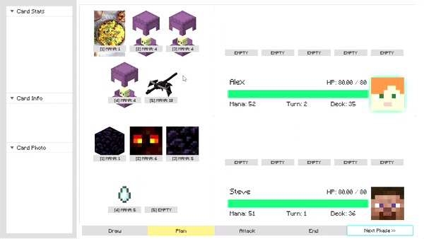
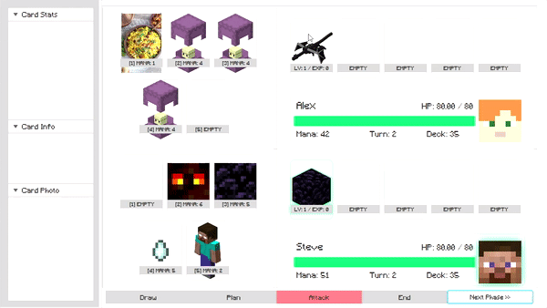
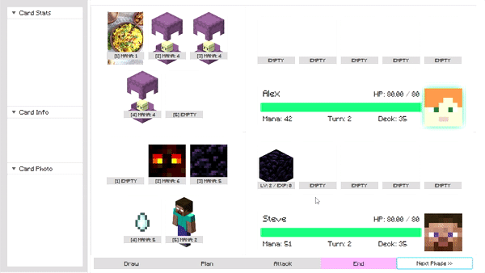

# Aether Wars: A Minecraft-Inspired Turn-Based Card Game

> Program implementasi _turn-based card game_ berdasarkan game _Minecraft / Yu-Gi-Oh!_ menggunakan bahasa Java dan menerapkan konsep-konsep _Object-Oriented Programming_ serta _Design Pattern_
> > Tugas Besar 2 IF2210 Pemrograman Berorientasi Objek
> > Semester II 2021/2022

## Deskripsi

AetherWars merupakan sebuah turn-based card game, dengan dua orang pemain. Implementasi permainan menggunakan bahasa Java dengan memanfaatkan konsep OOP. Dengan menggunakan konsep-konsep OOP dan _design pattern_, program ini dapat dimainkan oleh dua orang pemain secara lokal.

## Struktur Kode
- `main/java/com/aetherwars`: berisi kode utama untuk permainan
  - `controllers`: folder berisi class controller untuk file-file FXML
  - `core`: folder berisi file utama untuk permainan, berisi DisplayManager, GameManager, dan Loader
  - `events`: implementasi turunan events untuk digunakan saat permainan
  - `interfaces`: implementasi interface untuk design pattern
  - `models`: berisi model-model yang digunakan dalam permainan (kartu, dek, _factory_, _player_, dan lain-lain)
  - `util`: utilitas untuk melakukan _parsing_ file
  - `AetherWars.java`: kode utama yang dijalankan
- `resources/com/aetherwars`: assets yang digunakan dalam permainan
  - `background`: latar belakang dalam permainan
  - `card`: assets mengenai kartu
    - `data`: file konfigurasi kartu dalam bentuk .csv
    - `image`: gambar kartu
  - `deck`: contoh _deck_ yang dapat digunakan untuk _deck importing_
  - `font`: font dan _stylesheet_ untuk penggunaan font
  - `gui`: file `FXML` sebagai antarmuka permainan
  - `music`: _Sorrowful Lullaby by C418_
- `test`: folder berisi testing

## Requirements
- <a href = "https://www.oracle.com/java/technologies/javase/javase8-archive-downloads.html">Java SE 8 (JDK 8u202)</a>

## Cara Compile dan Run
1. _Clone_ repository ini terlebih dahulu, lalu buka terminal _Windows Powershell_
2. Navigasikan ke dalam folder `src`, lalu jalankan perintah berikut
```java
./gradlew run 
```

## Gameplay 
- Permainan dilakukan oleh dua orang pemain.
- Terdapat empat phase tiap turn :
  - ## **Draw** 
    Pemain mengambil kartu 3 kartu dari deck. Dari 3 kartu, pemain memilih satu kartu untuk digunakan, 2 kartu dikembalikan ke deck. kartu maksimal yang bisa dimiliki pemain adalah 5 kartu.
    
    
   
  - ## **Plan** 
    Pemain dapat melakukan beberapa aksi :
    1. Meletakkan kartu karakter ke board.
    2. Menggunakan spell pada karakter di board.
    3. Membuang karakter yang dimiliki atau yang ada di board.
    4. Menggunakan mana atau exp.
    
    

  - ## **Attack**
    Pemain dapat menyerang kartu karakter milik lawan, atau pihak lawan secara langsung (HP pihak lawan akan berkurang) Pemain bisa langsung menyerang pihak lawan apabila tidak ada kartu karakter pada _board_ lawan
    
    
    
  - #### **End**
    Mengakhiri giliran seorang pemain dan mengembalikan kendali ke pemain lawan.
    
    
    
- Permainan akan berakhir apabila salah satu pemain tidak mempunyai HP / kartu di _deck_ tersisa

## Authors
| Nama | NIM | Email |
| ----- | --- | ----------|
|Ilham Prasetyo Wibowo | 13520013 | <13520013@std.stei.itb.ac.id> |
|Gregorius Moses Marevson | 13520052 | <13520052@std.stei.itb.ac.id> |
|Amar Fadil | 13520103 | <13520103@std.stei.itb.ac.id> |
|Owen Christian Wijaya | 13520124 | <13520124@std.stei.itb.ac.id> |
|Fachry Dennis Heraldi | 13520139 | <13520139@std.stei.itb.ac.id> |

## Credit

Minecraft images and description are taken from [Minecraft Wikia](https://minecraft.fandom.com/wiki/)
