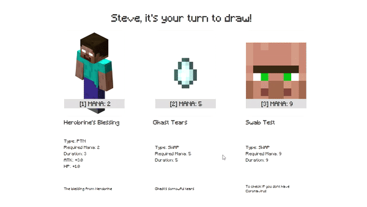

# Minecraft : Aether Realm Wars

Proyek ini dibuat untuk memenuhi tugas mata kuliah IF2210 Pemrograman Berorientasi Objek tahun 2021 semester 2.

## About Project

Game merupakan turn-based game, dengan dua orang pemain. Implementasi permainan menggunakan bahasa Java dengan memanfaatkan konsep OOP. 

## Requirements
- Java 8
- Gradle

## How To Run 
``` 
gradlew run 
```

## Gameplay 
### Rules
- Permainan dilakukan oleh dua orang pemain.
- Terdapat empat phase tiap turn :
  - Draw \
    Pemain mengambil kartu 3 kartu dari deck. Dari 3 kartu, pemain memilih satu kartu untuk digunakan, 2 kartu dikembalikan ke deck. kartu maksimal yang bisa dimiliki pemain adalah 5 kartu.
  - Plan \
    Pemain dapat melakukan beberapa aksi :
    1. Meletakkan kartu karakter ke board.
    2. Menggunakan spell pada karakter di board.
    3. Membuang karakter yang dimiliki atau yang ada di board.
    4. Menggunakan mana atau exp.
  - Attack \
    Pemain dapat menyerang karakter lawan, atau hp lawan. Pemain tidak bisa menyerang hp lawan jika ada karakter pada board.
  - End \
    Pemain berganti giliran.
- Pemain menang jika HP lawan nol, atau deck lawan habis.

### Visuals
#### Draw


### Plan


### Attack 


### End


## Authors
| Nama | NIM | Email |
| ----- | --- | ----------|
|Ilham Prasetyo Wibowo | 13520013 | <13520013@std.stei.itb.ac.id> |
|Gregorius Moses Marevson | 13520052 | <13520052@std.stei.itb.ac.id> |
|Amar Fadil | 13520103 | <13520103@std.stei.itb.ac.id> |
|Owen Christian Wijaya | 13520124 | <13520124@std.stei.itb.ac.id> |
|Fachry Dennis Heraldi | 13520139 | <13520139@std.stei.itb.ac.id> |

## Credit

Minecraft images and description are taken from [Minecraft Wikia](https://minecraft.fandom.com/wiki/)